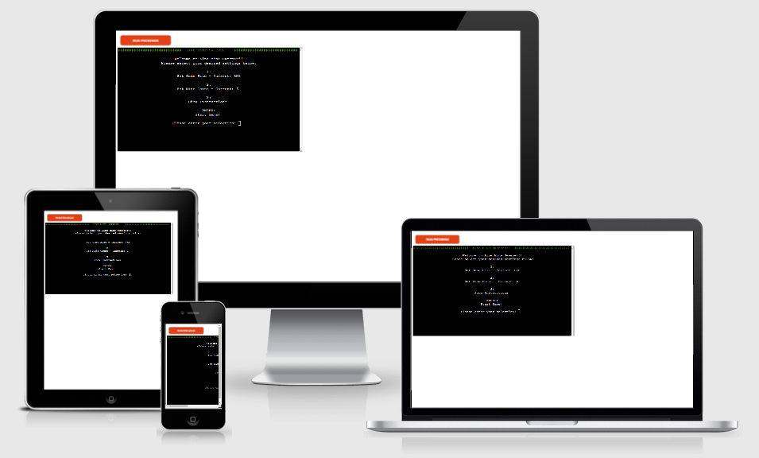

# Line Mine Sweeper - [Live Site](https://line-mine-sweeper.herokuapp.com/)

**Line Mine Sweeper** is a web terminal based Minesweeper game, deployed using the Code Institute mock terminal, via Heroku.

User's use coordinates and flags to reveal the location of all mines in the grid, without detonating any of them,
flagging all of the mines and revealing all non-mine cells to win.

## Table of Contents
- [Line Mine Sweeper - Live Site](#line-mine-sweeper---live-site)
  - [Table of Contents](#table-of-contents)
  - [How to Play](#how-to-play)
  - [Features](#features)
  - [Data Model](#data-model)
  - [Library's/Modules](#librarysmodules)
  - [Testing](#testing)
  - [Deployment](#deployment)
  - [Credits](#credits)

## How to Play

## Features

## Data Model

## Library's/Modules

## Testing

## Deployment

## Credits