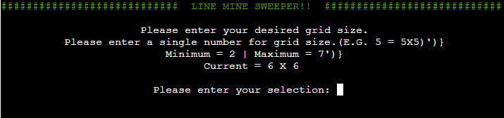

# Line Mine Sweeper - [Live Site](https://line-mine-sweeper.herokuapp.com/)

**Line Mine Sweeper** is a web terminal based Minesweeper game, deployed using the Code Institute mock terminal, via Heroku.

User's use coordinates and flags to reveal the location of all mines in the grid, without detonating any of them,
flagging all of the mines and revealing all non-mine cells to win.

## Table of Contents
- [Line Mine Sweeper - Live Site](#line-mine-sweeper---live-site)
  - [Table of Contents](#table-of-contents)
  - [How to Play](#how-to-play)
  - [Features](#features)
    - [Existing Features](#existing-features)
    - [Future Features](#future-features)
  - [Data Model](#data-model)
  - [Libraries/Modules](#librariesmodules)
  - [Testing](#testing)
  - [Deployment](#deployment)
  - [Credits](#credits)

## How to Play

Line Mine Sweeper is a terminal version of the game Minesweeper, with the same rules and goals, with the only difference being the use of entered coordinates instead of a graphical interface.

In this game, the pleyer selects their board size and the quantity of mines they would likee to have to find.
At this point, they player also has the option of showing the instructions for how to play.

Once all options have been selected, the player can press "ENTER" to start the game.

Each turn, the player enteres the row, then the column for their cell selection. If the player thinks that cell has a mine in it, they press "f" to flag it.
If they think that cell is a number that they need to reveal, they press "ENTER".

If they flag the cell, then the cell will show an "F". The player can put in the same coordinates and press "f" again to unflag that cell if they change their mind.

If they choose to reveal the cell, and they are correct, the number of that cell will be revealed.

The number of the cell shows how many mines surround that cell.
For example, if a cell has the number 1, that means that in one of the 8 cells that surround it, there is one mine.

If the player is able to flag all of the mines on the board, and reveal all of the other cells, they win.

If at any point, the player reveals a mine, it's game over!

## Features

### Existing Features

* Customizable Board Size
  * Player can set the size of the board
  * 
* Customizable Mine Count
  * Player can choose how many mines are in play
  * 
* Instructions Page
  * Player can choose to show the instructions for the game
  * 
* Randomly Located Bombs
  * Bombs are placed randomly on the board
* Colorization
  * The terminal is colored to add some style
* Input Validation/Error Alerts
  * Player input is validated
    * Only appropriate input is accepted
  * Incorrect inputs are alerted to the player
    * Player is alerted to incorrect input
    * Player is alerted to impossible moves
    * Plyer is alerted to already completed moves
  * 
* Terminal Clearing
  * Terminal is cleared before each screen update
  * Keeps the information displayed relevant, and easy to read
* ASCII Drawn Board
  * To make getting the row and column easy
  * 
* Game Results
  * Winner Screen
  * Game Over Screen
  * 
  * 

### Future Features

* Game Over Animation
  * Possible animation that plays when the game ends, transitioning to the game over screen
* Random Settings Option
  * Give the player the option to play a game with random settings
* Color Options
  * Give the player the option to change the colors used

## Data Model

Line Mine Sweeper has been built around a game class, to allow for the creation and isolation of seperate game instances, with their own settings and grids.

This game class houses the settings for the instance, the values of both the visable grid displayed to the user, and the hidden grid with the actual cell values.

This class has been built with specific methods used to operate and play the game. These include but are not limited to the user_input method,
that takes the input from the player and checks it for validitiy, before passing it to the update board method, where the player's selection is then checked for the next action to take.
As well as the draw_board method, that is used to refresh the displayed board in the terminal window.

## Libraries/Modules

This game makes use of some external libraries/modules for varying purposes.

* os
  * Used to clear the terminal window, based on what OS the game is running on
* randint from random
  * Used to generate a random cell location when setting the mines
* readkey from readchar
  * Used to get user input with a single keypress
  * Used to pause for any user input when information is displayed
* init, fore from colorama
  * Used to color text displayed in the terminal

## Testing

## Deployment

This project has been deployed via Heroku, making use of the mock terminal provided by Code Institute.

* Process for deployment
  * Clone this repository
  * Sign up/into [Heroku](https://id.heroku.com/login)
  * Create a new Heroku app
  * Give the new app a name
  * Select the appropriate region
  * Open the "Settings" tab on the Heroku App dashboard
  * Add a new config var
    * Set the KEY to "PORT"
    * set the VALUE to "8000"
  * Set the buildpacks to Python and NodeJS
    * (NOTE - Needs to be in that order)
  * Open the "Deploy" tab
  * Select the "GitHub" deployment method
  * Select "Link to GitHub"
  * Link the new Heroku app to the GitHub repository & click "Connect"
  * Option A:
    * Enable Automatic Deploys
      * Will automatically re-deploy with any updates or changes made
  * Option B:
    * Deploy Branch Manually
      * Will deploy the current release on GitHub

## Credits